# Transfer_style

## 0. Install and launch Gradio App

Git clone the repo. Then install the dependencies:

```
pip install -r requirements.txt
```

To launch gradio interface:

```
python gradio_app.py
```

## 1. Load Input Image

You can load the input image on the Input section. Then it is possible to choose the parameter of the model depending on your needs. 

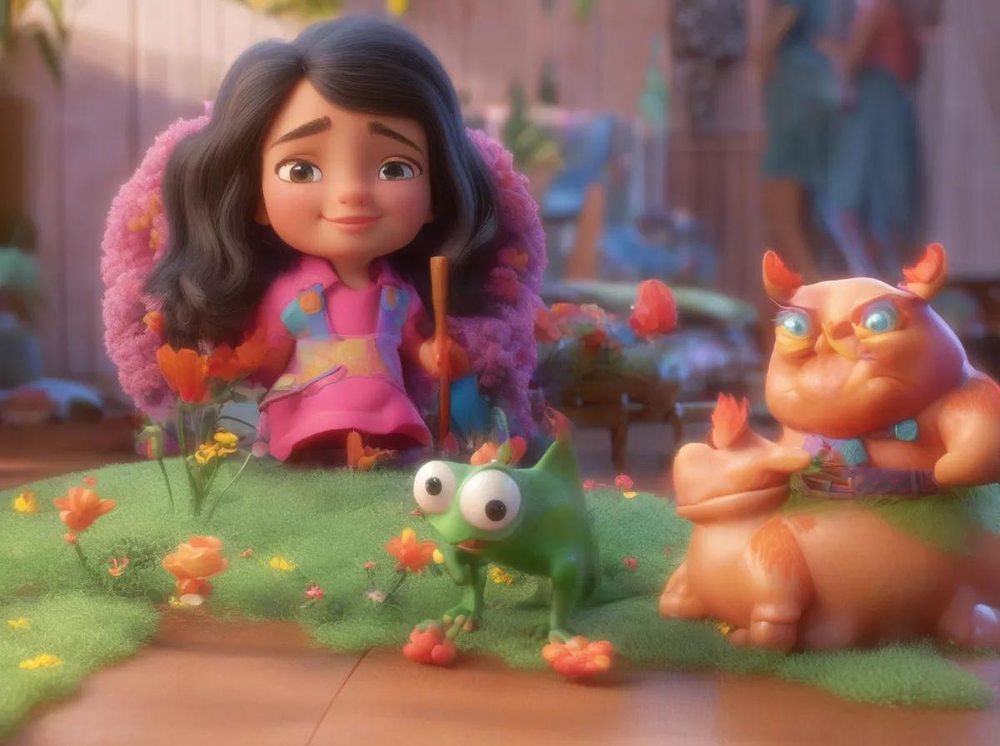

## 2. Parameters

You can choose the image style among 6 different styles: Pixar, White/Black Movie, Pixel, Anime, Illustration, Low-Poly. Styles prompt come from exemple of positive from (https://medium.com/phygital/top-40-useful-prompts-for-stable-diffusion-xl-008c03dd0557) and negative exemple from (https://blog.segmind.com/best-negative-prompts-in-stable-diffusion/).

See exemples below starting from the following input image:

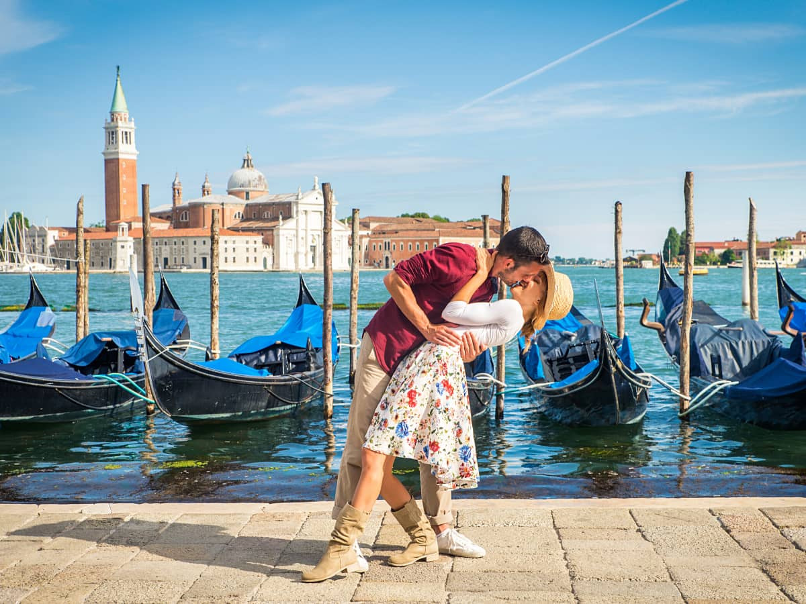 

Pixar                      |  White/Black Movie          |  Pixel       
:-------------------------:|:---------------------------:|:-----------------------------:
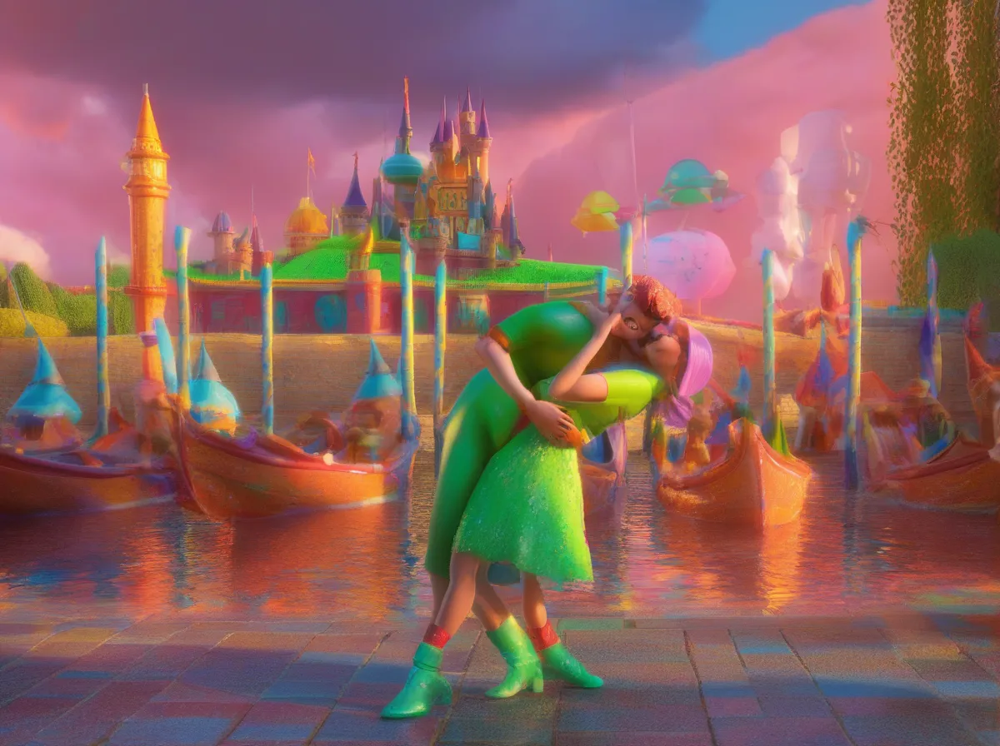   | 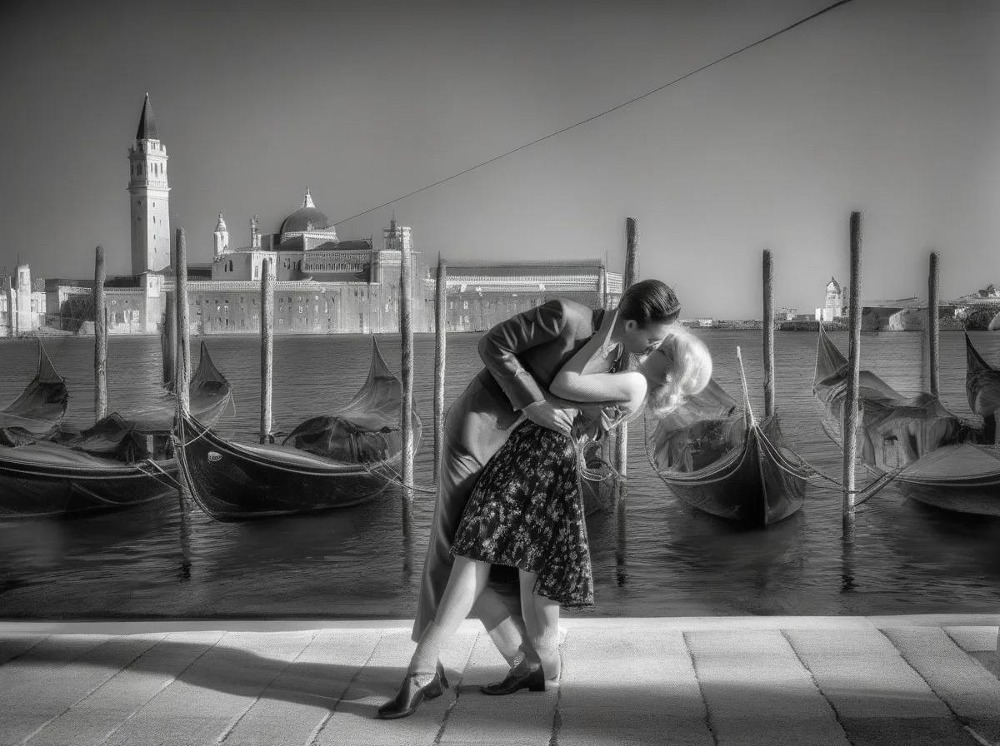 | 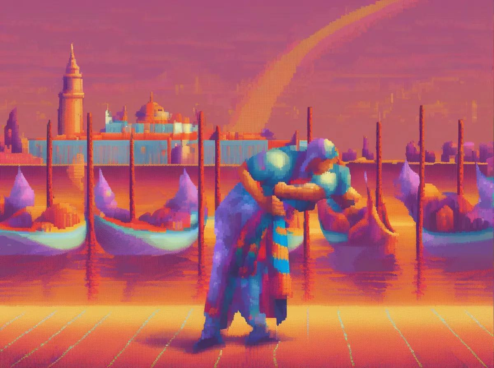


Anime                   |  Illustration                |  Low-Poly      
:----------------------:|:----------------------------:|:-----------------------------:
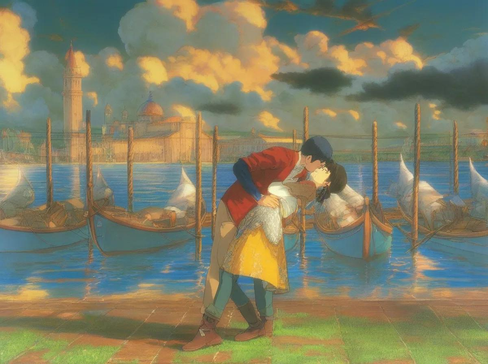   | 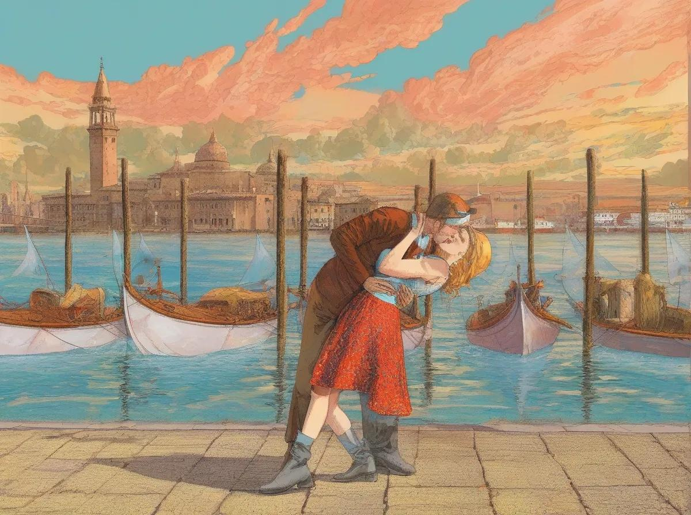 | 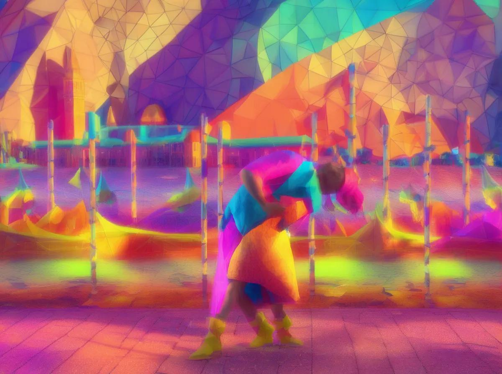


Generation steps: Control the trade-off between quality and speed. Higher values means more quality but more processing time.<br />

10 number of iterations         |  30 number of iterations |  60 number of iterations       
:------------------------------:|:------------------------:|:-----------------------------:
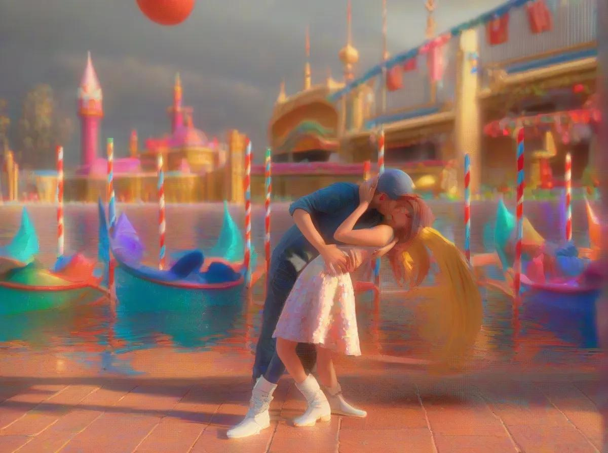   |  | 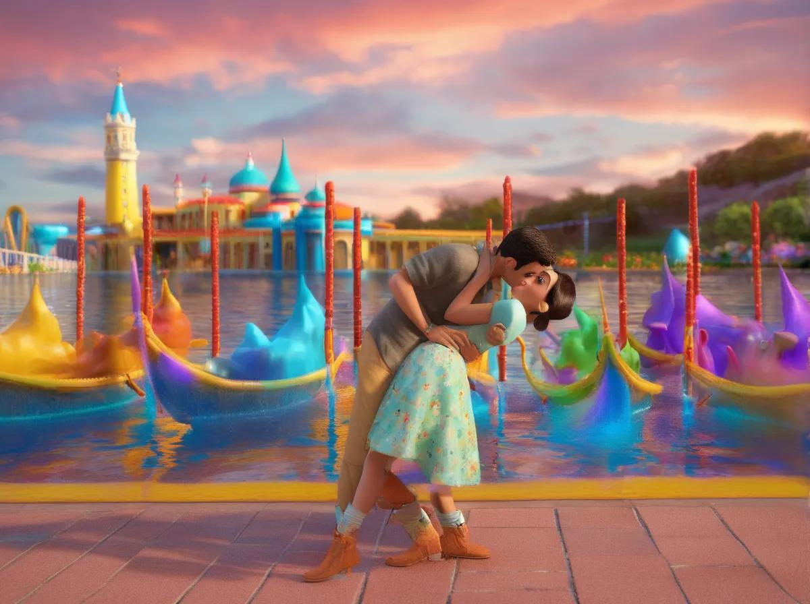

Guidance Scale: Higher values means the generated image will be closer to text prompt.<br />

Guidance Scale=1                         |  Guidance Scale=5        |  Guidance Scale=9         
:---------------------------------------:|:------------------------:|:--------------------------------------:
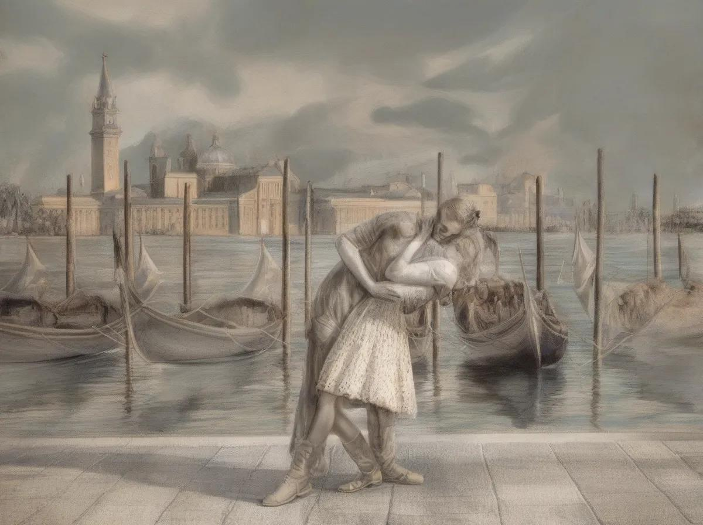   |  | 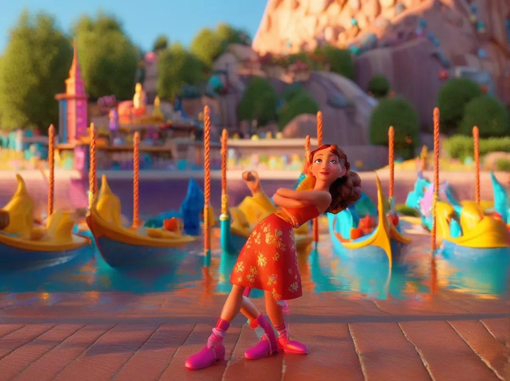

Controlnet Conditioning: Higher values means the generated image will be closer to input image in terms of canny image. 0.5 is the best trade-off.<br />

Condition Scale=0.3        |  Condition Scale=0.5     |  Condition Scale=0.9         
:-------------------------:|:------------------------:|:------------------------:
   |  | 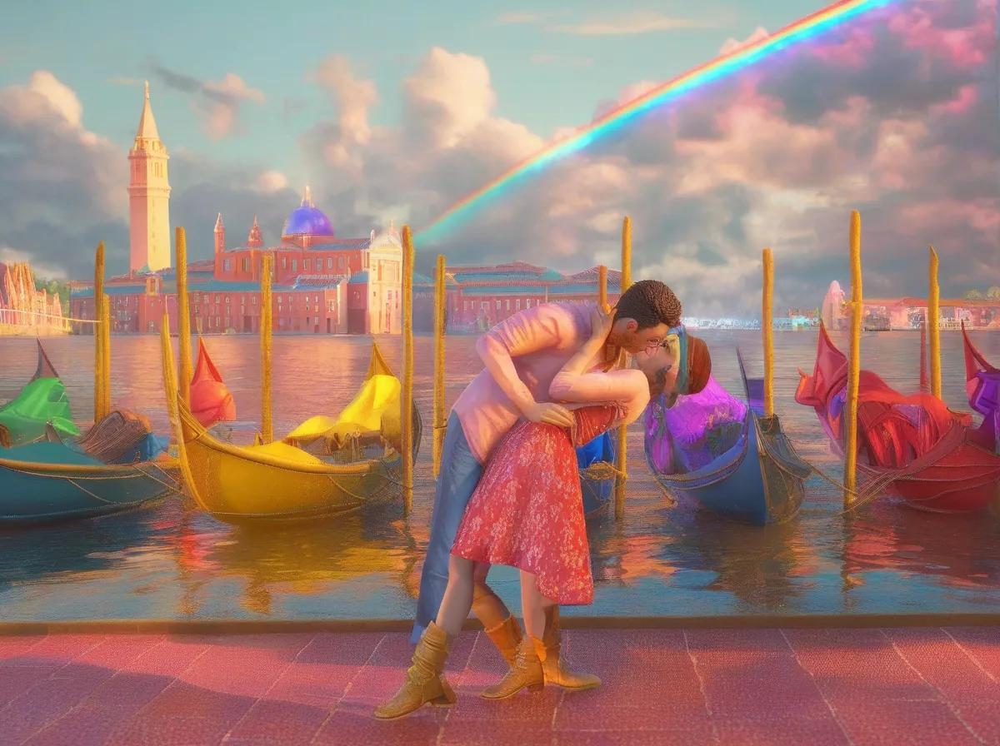


## 3. Generate Image Transfer Style

Click on Generate Button. It will use a SDXL model along a ControlNet model that will ensure to keep the most features of the input images. It is not the raw image that is inputed but the canny version (images with only edges from image objects)